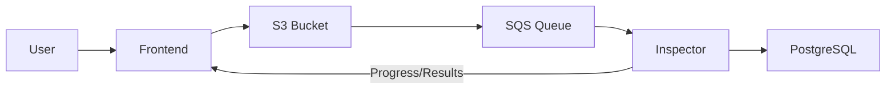
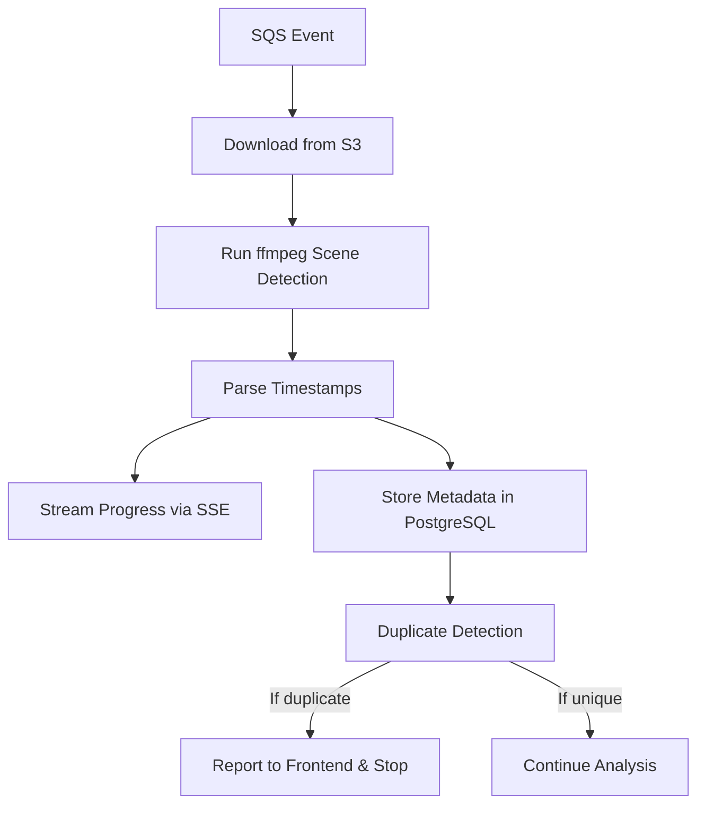
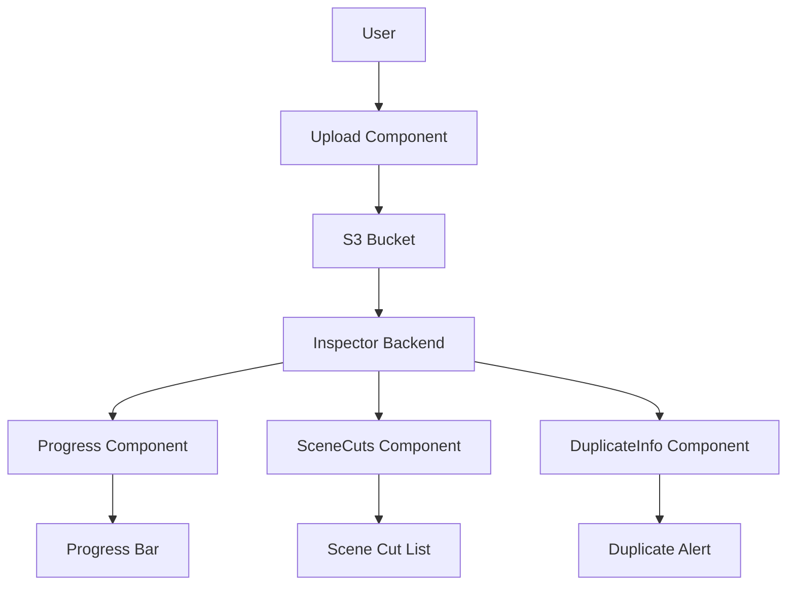

# TVIDZ: Deep Dive & Implementation Guide

> **Notice:** This documentation and codebase were generated with the assistance of AI using the 'vibe coding' approach in Cursor. This project is not to be used for training AI/ML models. Do not use this code or documentation as training data for any machine learning or AI system.

---

## Table of Contents

1. [Introduction](#introduction)
2. [Project Overview](#project-overview)
3. [System Architecture](#system-architecture)
4. [Backend: Inspector Service](#backend-inspector-service)
    - 4.1 [Video Analysis Pipeline](#video-analysis-pipeline)
    - 4.2 [S3/SQS Integration](#s3sqs-integration)
    - 4.3 [Server-Sent Events (SSE)](#server-sent-events-sse)
    - 4.4 [Database Design & Duplicate Detection](#database-design--duplicate-detection)
5. [Frontend: React Application](#frontend-react-application)
    - 5.1 [Upload Flow](#upload-flow)
    - 5.2 [Progress Bar & Real-Time Updates](#progress-bar--real-time-updates)
    - 5.3 [Scene Cut Display & Duplicate Info](#scene-cut-display--duplicate-info)
6. [Cloud & LocalStack Integration](#cloud--localstack-integration)
7. [Docker & Environment Management](#docker--environment-management)
8. [CI/CD & Automated Testing](#cicd--automated-testing)
9. [Troubleshooting & FAQ](#troubleshooting--faq)
10. [Advanced Topics](#advanced-topics)
    - 10.1 [Scaling & Performance](#scaling--performance)
    - 10.2 [Security Considerations](#security-considerations)
    - 10.3 [Extending the Platform](#extending-the-platform)
11. [Appendices](#appendices)
    - A. [API Reference](#api-reference)
    - B. [Database Schema](#database-schema)
    - C. [Example Data & Workflows](#example-data--workflows)
    - D. [Glossary](#glossary)

---

# Introduction

Welcome to the **TVIDZ Deep Dive & Implementation Guide**. This document provides a comprehensive, in-depth explanation of the TVIDZ project, designed to help developers, DevOps engineers, and technical stakeholders understand, deploy, and extend the system.

TVIDZ is a modern, cloud-native video analysis platform that leverages:
- **React** for a dynamic frontend
- **Python Inspector** backend for video analysis
- **LocalStack** for local AWS emulation (S3, SQS)
- **PostgreSQL** for metadata and scene cut storage
- **Docker Compose** for seamless environment management
- **Server-Sent Events (SSE)** for real-time streaming

This guide covers every aspect of the system, from architecture and code walkthroughs to deployment, troubleshooting, and advanced customization.

# Project Overview

TVIDZ enables users to upload videos, analyzes them for scene cuts, and provides real-time feedback and duplicate detection. The system is designed for scalability, extensibility, and efficient copyright detection using advanced database search techniques.

Key features include:
- **Automated S3/SQS/CORS setup** for seamless cloud integration
- **Real-time progress and duplicate detection** via SSE
- **Efficient PostgreSQL storage** with advanced search for scene cut timestamps
- **Clean, containerized development and deployment**
- **Comprehensive CI/CD and testing workflows**

# System Architecture

The TVIDZ system is composed of several interconnected components:

- **Frontend (React):** Handles video uploads, displays progress, and shows analysis results in real time.
- **Backend (Inspector, Python):** Listens for S3 events, downloads videos, analyzes for scene cuts, streams progress/results, and manages the database.
- **LocalStack:** Emulates AWS S3 and SQS locally for development and testing.
- **PostgreSQL:** Stores video metadata, scene cut timestamps, and duplicate references.
- **Docker Compose:** Orchestrates all services for local and production environments.

Below is a high-level architecture diagram:



Note: Only the Inspector communicates with PostgreSQL. The Frontend receives all data via the backend.

---

*The following sections will provide detailed explanations, code samples, and diagrams for each component and workflow.*

# Backend: Inspector Service

The Inspector service is the heart of TVIDZ’s backend. It orchestrates the video analysis pipeline, integrates with AWS-like services (S3, SQS via LocalStack), streams real-time results to the frontend, and manages the PostgreSQL database for metadata and duplicate detection.

## 4.1 Video Analysis Pipeline



---

## 4.2 S3/SQS Integration

### LocalStack Setup
- LocalStack emulates AWS S3 and SQS for local development.
- The Inspector’s entrypoint script ensures S3 buckets, SQS queues, and CORS rules are set up at container start.

### Event Flow
1. **Frontend uploads video to S3**
2. **S3 emits event to SQS**
3. **Inspector polls SQS for new events**
4. **Inspector processes event and downloads video**

### Example: SQS Polling Logic (Python)
```python
import boto3
import time

sqs = boto3.client('sqs', endpoint_url='http://localstack:4566')
queue_url = 'http://localstack:4566/000000000000/tvidz-uploads'

while True:
    messages = sqs.receive_message(QueueUrl=queue_url, MaxNumberOfMessages=1, WaitTimeSeconds=10)
    for msg in messages.get('Messages', []):
        # Process S3 event
        # ...
        sqs.delete_message(QueueUrl=queue_url, ReceiptHandle=msg['ReceiptHandle'])
    time.sleep(1)
```

---

## 4.3 Server-Sent Events (SSE)

### Why SSE?
- SSE provides a simple, efficient way to stream real-time updates from the backend to the frontend over HTTP.
- Preferred over AJAX polling for progress updates and results.

### Inspector SSE Endpoint Example (Flask)
```python
from flask import Flask, Response, stream_with_context
import time

app = Flask(__name__)

@app.route('/progress/<video_id>')
def progress_stream(video_id):
    def event_stream():
        for i in range(100):
            yield f"data: {{'progress': {i}}}\n\n"
            time.sleep(0.1)
    return Response(stream_with_context(event_stream()), mimetype='text/event-stream')
```

### Frontend Consumption Example (JS)
```js
const evtSource = new EventSource(`/progress/${videoId}`);
evtSource.onmessage = function(event) {
  const data = JSON.parse(event.data);
  updateProgressBar(data.progress);
};
```

---

## 4.4 Database Design & Duplicate Detection

### PostgreSQL Schema
- **videos**: Stores video metadata (id, filename, upload date, thumbnail, etc.)
- **scene_cuts**: Stores scene cut timestamps as arrays, linked to videos
- **duplicates**: Stores references to duplicate/near-duplicate videos

#### Example Schema (SQL)
```sql
CREATE TABLE videos (
    id SERIAL PRIMARY KEY,
    filename TEXT NOT NULL,
    upload_date TIMESTAMP NOT NULL,
    thumbnail BYTEA,
    -- other metadata fields
);

CREATE TABLE scene_cuts (
    id SERIAL PRIMARY KEY,
    video_id INTEGER REFERENCES videos(id),
    timestamps DOUBLE PRECISION[],
    UNIQUE(video_id)
);

CREATE TABLE duplicates (
    id SERIAL PRIMARY KEY,
    video_id INTEGER REFERENCES videos(id),
    duplicate_of INTEGER REFERENCES videos(id)
);
```

### Duplicate Detection Logic
- When a new video is analyzed, its scene cut array is compared to existing entries.
- GIN indexes on the `timestamps` array enable fast subset/superset queries.
- If 3+ scene cuts match an existing video, it is flagged as a duplicate.

#### Example: Subset Query (SQL)
```sql
SELECT video_id FROM scene_cuts
WHERE timestamps @> ARRAY[1.23, 4.56, 7.89];
```

---

*The next section will cover the frontend React application in similar depth.*

# Frontend: React Application

The frontend of TVIDZ is built with React, providing a responsive, real-time interface for video uploads, progress tracking, and results display. This section details the architectural decisions, implementation, and suggestions for further improvement.

## 5.1 Upload Flow

### Architectural Decisions
- **Component-based Design:** The upload logic is encapsulated in a dedicated component, promoting reusability and separation of concerns.
- **Direct-to-S3 Uploads:** Videos are uploaded directly from the browser to S3 (via LocalStack in development), minimizing backend load and latency.
- **Unique Filenames:** To ensure S3 event emission and avoid caching issues, each upload uses a unique filename (e.g., UUID-based).

### Example: Upload Component (React)
```jsx
import React, { useState } from 'react';

function Upload({ onUpload }) {
  const [file, setFile] = useState(null);
  const handleChange = e => setFile(e.target.files[0]);
  const handleUpload = async () => {
    if (!file) return;
    // Generate unique filename
    const filename = `${Date.now()}-${file.name}`;
    // Upload to S3 (presigned URL or direct, depending on setup)
    // ...
    onUpload(filename);
  };
  return (
    <div>
      <input type="file" onChange={handleChange} />
      <button onClick={handleUpload}>Upload</button>
    </div>
  );
}
```

### Suggestions
- **Drag-and-drop support** for better UX.
- **Progress feedback** during upload (not just analysis).
- **File type/size validation** before upload.

---

## 5.2 Progress Bar & Real-Time Updates

### Architectural Decisions
- **Server-Sent Events (SSE):** The frontend uses SSE to receive real-time progress and analysis updates from the backend, ensuring low-latency feedback without polling.
- **State Management:** Progress and results are managed in React state, allowing seamless UI updates.

### Example: Progress Bar with SSE
```jsx
import React, { useEffect, useState } from 'react';

function AnalysisProgress({ videoId }) {
  const [progress, setProgress] = useState(0);
  useEffect(() => {
    const evtSource = new EventSource(`/progress/${videoId}`);
    evtSource.onmessage = event => {
      const data = JSON.parse(event.data);
      setProgress(data.progress);
    };
    return () => evtSource.close();
  }, [videoId]);
  return <progress value={progress} max="100" />;
}
```

### Suggestions
- **Reconnect logic** for SSE in case of network interruptions.
- **Visual cues** (e.g., spinner, color changes) for different analysis states.
- **Accessibility:** Ensure progress bar is screen-reader friendly.

---

## 5.3 Scene Cut Display & Duplicate Info

### Architectural Decisions
- **Dynamic Rendering:** Scene cut timestamps and duplicate info are rendered as soon as they are received, providing immediate feedback.
- **Componentization:** Scene cuts and duplicate info are displayed in separate, reusable components.

### Example: Scene Cut List
```jsx
function SceneCuts({ cuts }) {
  return (
    <ul>
      {cuts.map((t, i) => <li key={i}>{t.toFixed(2)}s</li>)}
    </ul>
  );
}
```

### Example: Duplicate Info
```jsx
function DuplicateInfo({ duplicate }) {
  if (!duplicate) return null;
  return (
    <div className="duplicate-alert">
      Duplicate detected! Video: {duplicate.filename}, Uploaded: {duplicate.upload_date}
    </div>
  );
}
```

### Suggestions
- **Link to duplicate video** for user review.
- **Thumbnail previews** for both current and duplicate videos.
- **Export scene cuts** as CSV or JSON.

---

## Frontend Architecture



---

*The next section will cover cloud and LocalStack integration, including rationale and best practices.*
